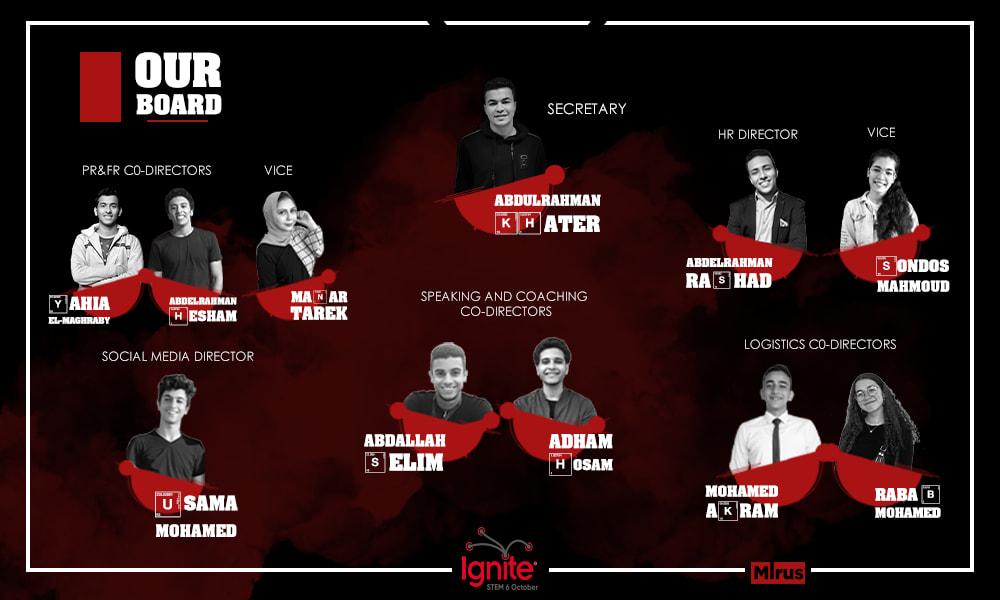

Amongst four Ignite branches in Egypt, Ignite STEM 6 October managed to successfully host the first ever Ignite event in Egypt on August 15th 2020. The event, managed by a group of rising seniors, was held virtually due to the circumstances caused by the pandemic, which inhibited the potential of the team. However, the students managed to reach out to 92000+ people and counting. The event had 12 speakers with 12 exciting topics to discuss, including two from the school’s own: Mohamed Badr and Abdulrahman Nasr. The speakers were as follow:

- Mohamed Badr
- Aya Ahmed
- Mahmoud Salah
- Mariam Taher
- Waleed Tarabolsi
- Reem Khairy
- Ahmed El Naggar
- Abdulrahman Nasr
- Mazen Ahmed
- Osama Maharem
- El Zuzzat
- Rana Gamal

Ignite Talks is a fast-paced geek event started in 2006 by Brady Forrest and Bre Pettis. Since the first Ignite took place in Seattle around 10 years ago, Ignite has become an international phenomenon, with Ignite events produced in Helsinki, Tunisia, Paris, New York City and over 350 other locations in between.
Ignite’s mission is “Everyone Speaks”. We believe that public speaking builds confidence in individuals and that events like Ignite build community. Our goal is to make it possible for anyone, anywhere, to learn to present their ideas and their stories.

Ignite STEM 6 October’s founding board consisted of enthusiastic STEM students desired to share knowledge for everyone. They worked hard for 6 months to provide a fruitful event that is digestible to people of all ages. The high board is as follows:

- Hussein Mostafa & Ali El Badry (Co-Presidents)
- Abdulraman Khater (Secretary)
- Abdulrahman Abdulnasser & Kerolos Kamal (Website Managers)
- Omar Khaled (Social Media Director)
- Abdullah Selim & Adham Hossam (Speaking & Coaching Co-Directors)
- Youssef Selim (Speaking & Coaching Vice-Director)
- Manar Tarek (PR & FR Director)
- Shrouk El-Banna (PR & FR Vice Director)
- Mohamed Akram & Rabab Mohamed (OC Co-Directors)
- Mohamed Mahdy & Ahmed Magdy (Media Co-Directors)
- Abdulrahman Rashad & Sondos Mahmoud (HR Co-Directors)

If you would like to watch the event, kindly click [here](https://bit.ly/3mLOLuz).
